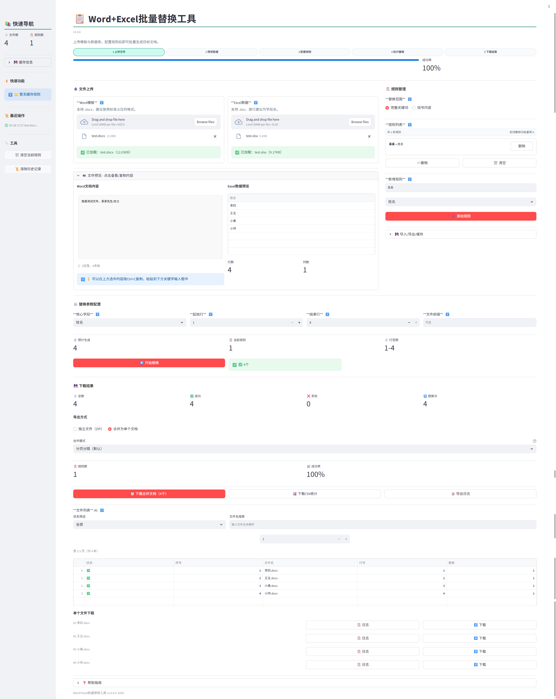

# 🚀 WordReplace 2.0

> Word + Excel 批量替换工具（单镜像版）

把 Word 模板（`.docx`）和 Excel 数据（`.xlsx/.xls`）批量合成目标文档，支持一键导出 ZIP 或合并文档。  
适合：通知书、合同、证书、函件、名册等标准化文档场景。



---

## 🧩 为什么用它

- 批量替换：模板关键字自动匹配 Excel 列
- 结果清晰：执行后直接看到总数/成功/失败/替换次数
- 导出灵活：支持 ZIP 批量下载 + 合并文档下载
- 部署简单：单镜像、单容器，一条命令即可启动

---

## 🐳 30 秒快速部署（推荐）

### 方式 1：本地源码一键启动

```bash
docker compose up -d --build
```

打开：`http://localhost:12344`

---

### 方式 2：直接拉取已发布镜像（最省事）

新建 `docker-compose.yml`，粘贴下面内容：

```yaml
version: "3.9"
services:
  wordreplace:
    image: ghcr.io/marod1m/wordreplace:latest
    container_name: wordreplace
    restart: unless-stopped
    ports:
      - "12344:8000"  # 只改左侧端口即可
```

启动：

```bash
docker compose up -d
```

访问：`http://你的服务器IP:12344`

---


## 💾 可选：持久化数据库（推荐）

默认情况下，规则数据保存在容器内。若你会重建容器，建议映射数据库目录：

```yaml
version: "3.9"
services:
  wordreplace:
    image: ghcr.io/marod1m/wordreplace:latest
    container_name: wordreplace
    restart: unless-stopped
    ports:
      - "12344:8000"
    volumes:
      - ./data:/app/data
```

说明：
- 容器内数据库路径：`/app/data/wordreplace.db`
- 主机目录 `./data` 会保存数据库文件，重建容器后规则不会丢失。

---

## 📦 群晖用户（简单版）

在群晖 Container Manager 新建项目，直接粘贴上面的 compose。  
你通常只需要改两处：

- 端口：`12344:8000`（改成你想用的端口）
- 镜像版本：`latest`（或固定版本如 `v2.0.0`）

---

## ✅ 使用流程（5 步）

1. 上传 Word 模板和 Excel 数据
2. 添加替换规则（模板关键字 -> Excel 列名）
3. 设置起始行、结束行、文件名列
4. 点击开始替换
5. 下载 ZIP 或合并文档

---

## 🗂️ 项目结构（核心）

```text
backend/
  app/
    api/        # 路由
    services/   # 替换与导出逻辑
    models/     # SQLite 模型
    schemas/    # 请求/响应模型
frontend/
  src/app/      # 页面
  src/lib/api.ts
Dockerfile      # 单镜像构建（前后端合并）
```

---

## 🛠️ 开发模式（可选）

如果你要本地调试源码：

后端：
```bash
cd backend
python3 -m venv .venv
source .venv/bin/activate
pip install -r requirements.txt
uvicorn app.main:app --reload --port 8000
```

前端：
```bash
cd frontend
cp .env.local.example .env.local
pnpm install --ignore-scripts
pnpm dev
```

---

## ⚙️ GitHub 自动构建

仓库已配置自动构建并推送 GHCR：

- 工作流：`.github/workflows/docker-publish.yml`
- 触发：push 到 `main`、推送 `v*.*.*` 标签、手动触发
- 镜像：`ghcr.io/<你的仓库>`
- 标签：`latest` + 语义化版本

---

## ❓ 常见问题

- 执行按钮不可点：请确认已上传两个文件、至少一条规则、行号范围有效。
- 导出失败：请先执行替换并确认已生成结果。
- Excel 列名不生效：规则列名必须与 Excel 表头完全一致。


---

## 🔒 固定版本部署（推荐生产环境）

不建议生产环境长期使用 `latest`，建议固定版本标签：

```yaml
version: "3.9"
services:
  wordreplace:
    image: ghcr.io/marod1m/wordreplace:v2.0.0
    container_name: wordreplace
    restart: unless-stopped
    ports:
      - "12344:8000"
```

---

## 🔄 升级与回滚

### 升级到最新版本

```bash
docker compose pull
docker compose up -d
```

### 升级到指定版本

1. 修改 compose 中镜像标签（例如 `v2.0.1`）
2. 执行：

```bash
docker compose pull
docker compose up -d
```

### 回滚到旧版本

1. 将镜像标签改回历史版本（例如 `v2.0.0`）
2. 执行：

```bash
docker compose pull
docker compose up -d
```

---

## 🧹 停止与卸载

停止服务：

```bash
docker compose down
```

连同镜像一起清理（可选）：

```bash
docker compose down --rmi local
```
